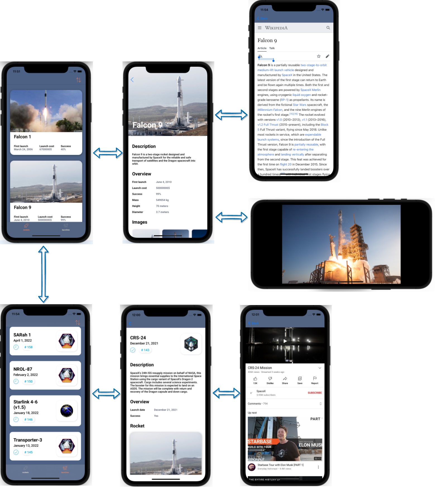

# SpaceXOpenAPIRealization

An iOS application that shows SpaceX rockets and launches.

## What I Learned
 - native network tools
 - native animation
 - testing

 - ```XCTest```, ```UICollectionView```, ```URLSession```

   ## Prototype
   

   ## Workflow 
      
